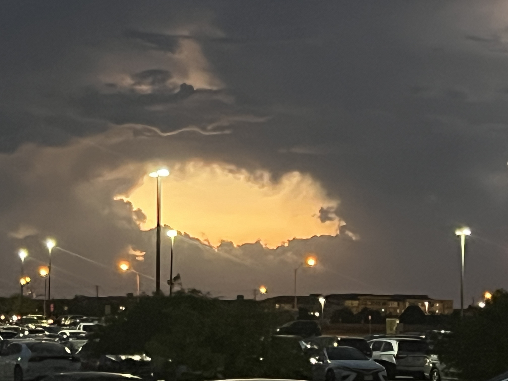

<html lang="en">
<head>
    <meta charset="UTF-8">
    <meta name="viewport" content="width=device-width, initial-scale=1.0">
    <title>Joshua Fitzerald - Portfolio</title>
    <link rel="stylesheet" href="styles.css"> <!-- Link to your CSS file -->
</head>
<body>
    <header>
        <h1>Joshua Fitzerald</h1>
        
Programmer | Software Engineer | Web Developer | Powerlifter | Bodybuilder | Songwriter and Producer

    </header>

  <nav>
        <ul>
            <li>
              <a href="#about">About</a>
            </li>
            <li>
              <a href="#skills">Skills</a>
            </li>
            <li>
              <a href="#projects">Projects</a>
            </li>
            <li>
              <a href="#contact">Contact</a>
            </li>
            <li>
                <a href="#organizations">Organizations</a>
            </li>
        </ul>
    </nav>

  <section id="about">
      <h2>About Me</h2>
      
I am a sophomore studying Computer Software Engineering at the University of Texas at Dallas. I am developing my skills in software development and am eager to gain practical experience through internships and collaborative projects. I am commited to learning and growing in the field of technology.

  </section>

  <section id="skills">
      <h2>Skills</h2>
      <ul>
          <li>
              Python, Javascript, R Programming, HTML, and Microsoft SQL
          </li>
          <li>
              Team leadership, cooperation, effective communication, commitment, writing, and public speaking
          </li>
          <li>
              Microsoft Suite, Microsoft Excel
          </li>
      </ul>
  </section>

  <section id="projects">
      <h2>Projects</h2>
      <ul>
          <li>
                <h3>Job Hunt Web Scraper</h3>
                
Developed a Python-based web scraper using BeautifulSoup and Requests to extract job listings from TimesJobs.
                Implemented a search functionality allowing users to filter job postings by inputing their skills and the number of days since the job was posted,
                in which the program then displayed relevant job details, including company name, required skills, and links for more information.
                Enhanced user experience with dynamic input for customized job search criteria.
                Improved Python proficiency and web scraping skills by automating data retrieval and parsing HTML content.
                

                <a href="https://github.com/joshuafitzerald/jobwebscraper" target="_blank">View it here on GitHub</a>
          </li>
          <li>
                <h3>Discord Moderation Bot</h3>
                
Used python to program a Discord bot that enabled server administrators to define and enforce banned words in the chat.
                   Automated the detection and removal of flagged messages and built custom commands for adding, removing and viewing banned words, and for banning and unbanning users.
                

                <a href="link-to-repo" target="_blank">View on GitHub</a>
          </li>
          <li>
              <h3>Discord Reddit Alert Bot</h3>
              
Built a python script that monitors a forum on Reddit for recent posts with over 100 upvotes.
                 Implemented the Discord.py library into the script to create a Discord bot that sends direct messages to the user if there is a recent 100+ upvoted post on the Reddit forum.
                 Used asynchronous programming to handle periodic checks and notifications.

              <a href="link-to-repo" target="_blank">View on GitHub</a>
          </li>
            <!-- Add more projects as needed -->
      </ul>
  </section>

<section id="organizations">
    <h2>Organizations</h2>
    <ul>
         <li>
            <h3>Computer Security Group (UTD CSG)</h3>
            
Engaged in hands-on workshops that developed practical skills in the offensive side of cybersecurity, such as hacking into systems.
               Competed in CTF (Capture The Flag) events which consisted of hacking competitions among teams.
            

        </li>
        <li>
            <h3>Cybersecurity Club (UTD CYC)</h3>
            
Engaged in hands-on workshops to develop practical cybersecurity skills.
               Attended guest lectures by industry professionals to gain insights into cybersecurity careers.
            

        </li>
        <li>
            <h3>UTD Powerlifting Club</h3>
        </li>
        <li>
            <h3>Varsity Wrestling (Jordan High School)</h3>
            
Wrestled in the 145, 152, 160 and 170 lb weight class divisions.
               Competed in tournaments against other schools and districts.
               Demonstrated hard work and discipline. For example, one rep max for barbell bench press went from 185 lbs during Sophomore Year to 245 lbs in Junior Year. 
             Held the record for the fastest pin (Match win) of the 2022-2023 Wrestling Season of 14 seconds.
            

        </li>
    </ul>
</section>

  <section id="contact">
      <h2>Contact</h2>
      
Email: <a href="mailto:fitzeraldjoshuaanak@gmail.com">fitzeraldjoshuaanak@gmail.com</a>

  </section>

<iframe width="100%" height="300" scrolling="no" frameborder="no" allow="autoplay" src="https://w.soundcloud.com/player/?url=https%3A//api.soundcloud.com/tracks/1875444033&color=%23988c82&auto_play=false&hide_related=false&show_comments=true&show_user=true&show_reposts=false&show_teaser=true&visual=true"></iframe>
<a href="https://soundcloud.com/ricejosh-boi" title="JF Drago" target="_blank" style="color: #cccccc; text-decoration: none;">JF Drago</a> · <a href="https://soundcloud.com/ricejosh-boi/text-in-morning-feat-hadxw" title="TEXT IN MORNING (feat. $hadxw)" target="_blank" style="color: #cccccc; text-decoration: none;">TEXT IN MORNING (feat. $hadxw)</a>

<iframe width="100%" height="300" scrolling="no" frameborder="no" allow="autoplay" src="https://w.soundcloud.com/player/?url=https%3A//api.soundcloud.com/playlists/1646842606&color=%23544434&auto_play=false&hide_related=false&show_comments=true&show_user=true&show_reposts=false&show_teaser=true&visual=true"></iframe>
<a href="https://soundcloud.com/ricejosh-boi" title="JF Drago" target="_blank" style="color: #cccccc; text-decoration: none;">JF Drago</a> · <a href="https://soundcloud.com/ricejosh-boi/sets/on-god" title="ON GOD" target="_blank" style="color: #cccccc; text-decoration: none;">ON GOD</a>

  <footer>
      
&copy; 2024 Joshua Anak Fitzerald. All rights reserved.

  </footer>
</body>
</html>
