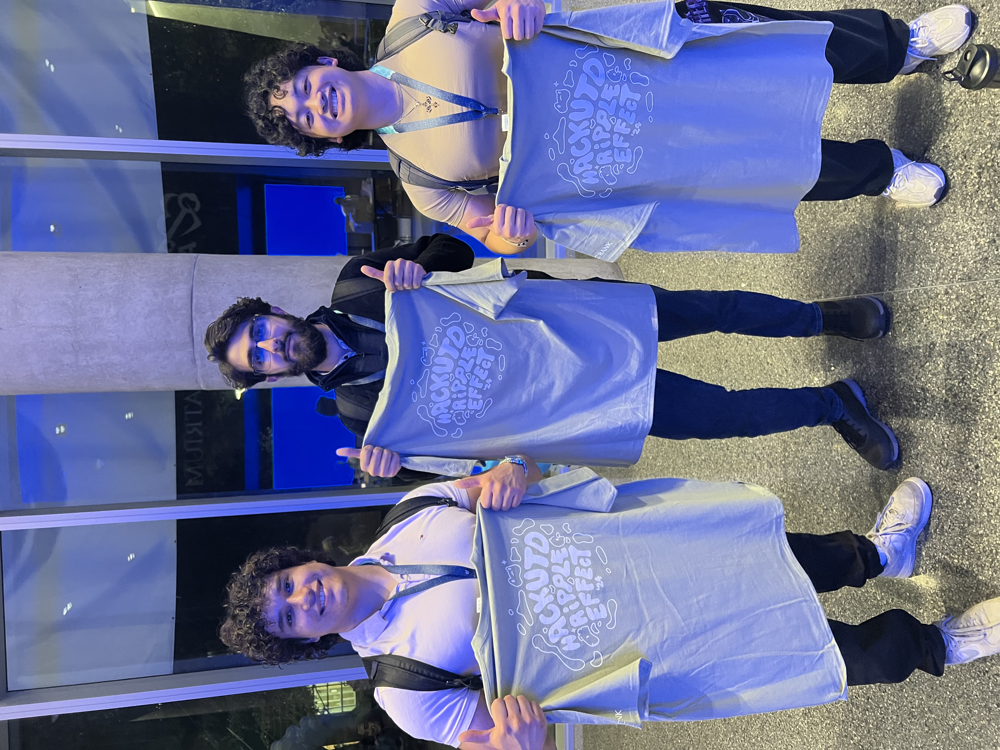
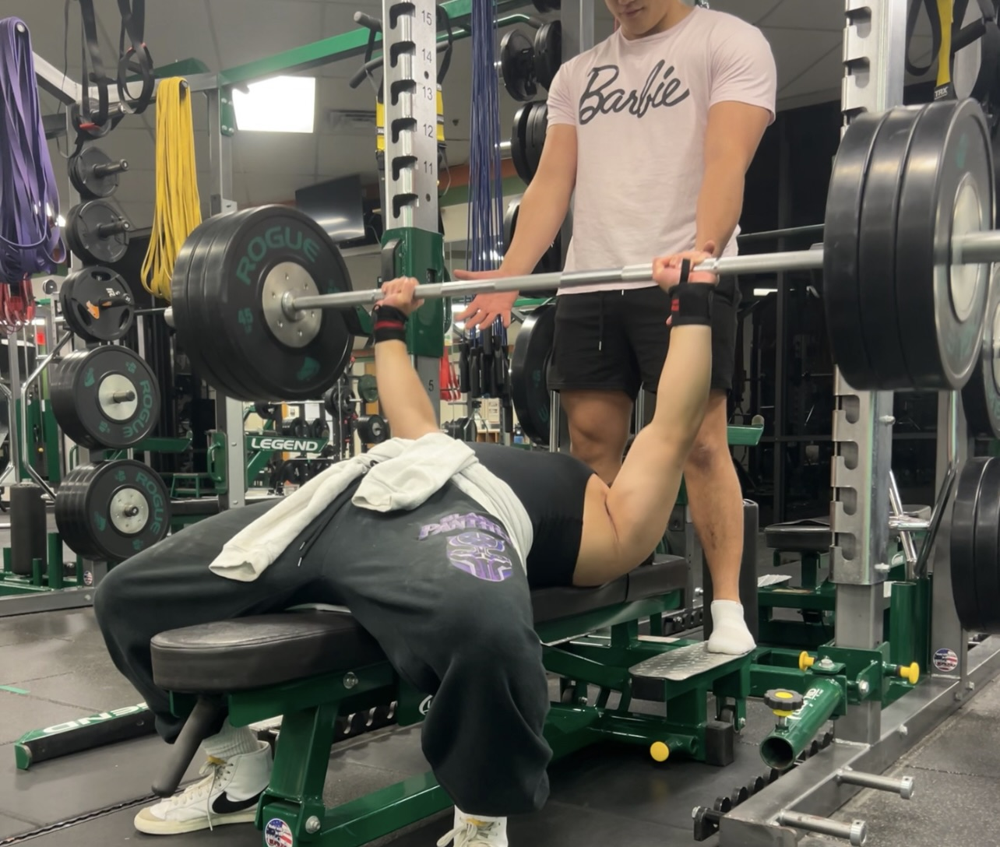

<html lang="en">
<body>
    <header>
        <h1>Joshua Fitzerald</h1>
        
Programmer | Software Engineer | Web Developer | Powerlifter | Bodybuilder | Songwriter and Producer

    </header>

  <nav>
     <h3>
             | <a href="#about">About</a> | <a href="#skills">Skills</a> | <a href="#projects">Projects</a> | <a href="#organizations">Organizations</a> | <a href="#contact">Contact and Socials</a> |
      </h3>
    </nav>

  <section id="about">
      <h2>About Me</h2>
      
I am a sophomore studying Computer Software Engineering at the University of Texas at Dallas. I am developing my skills in software development and am eager to gain practical experience through internships and collaborative projects. I am commited to learning and growing in the field of technology.

  </section>

  <section id="skills">
      <h2>Skills</h2>
      <ul>
          <li>
              Programming Languages: Python, Javascript, Java, R Programming, C++, HTML, and CSS
          </li>
          <li>
              Cybersecurity: Basic Network Security, Web Scraping
          </li>
          <li>
              API’s and Web Services: AWS, S3, Discord API, Reddit API, Microsoft Suite, Microsoft Excel, Microsoft SQL
          </li>
          <li>
              Other: Data analysis, Team leadership, cooperation, effective communication, teaching, commitment, writing, and public speaking.
          </li>
      </ul>
  </section>

  <section id="projects">
      <h2>Projects</h2>
      <ul>
           <li>
                <h3>Vehicle Fuel Economy Data Visualization App (Hackathon Project)</h3>
                    
                
An interactive web application that allows users to visualize and analyze vehicle fuel economy data from 2021 to 2025. The app provides filtering options, sorting, and dynamic charts to help users gain                     insights into fuel efficiency, CO2 emissions, and other important metrics.
                

                <h3>AI Data Analyst Chatbot Feature</h3>
                
This web application further helps users analyze vehicle fuel economy data (2021–2025) by leveraging AI. Users can input vehicle details and receive insights such as fuel efficiency, annual fuel costs, and comparisons with other vehicles. This AI utilizes the GPT-3.5-turbo model via OpenAI API. 
                        <a href="https://devpost.com/software/green_gear_analyitcs" target="_blank">View it here</a>
                

                
          </li>
           <li>
                <h3>iOS Expense Tracker App</h3>
                
Developed an iOS app for tracking personal expenses, built with Swift and Core Data. This app allows users to easily add, delete, and categorize expenses, with monthly and weekly                                            breakdowns for comprehensive budgeting insights.
                

          </li>
          <a href="https://github.com/joshuafitzerald/ExpenseTrackerApp" target="_blank">View it here on GitHub</a>
          <li>
                <h3>Job Hunt Web Scraper</h3>
                
Developed a Python-based web scraper using BeautifulSoup and Requests to extract job listings from TimesJobs.
                Implemented a search functionality allowing users to filter job postings by inputing their skills and the number of days since the job was posted,
                in which the program then displayed relevant job details, including company name, required skills, and links for more information.
                Enhanced user experience with dynamic input for customized job search criteria.
                Improved Python proficiency and web scraping skills by automating data retrieval and parsing HTML content.
                

                <a href="https://github.com/joshuafitzerald/jobwebscraper" target="_blank">View it here on GitHub</a>
          </li>
          <li>
              <h3>AWS Stock Market Real-Time Data Pipeline</h3>
              
Developed a data processing pipeline on AWS, integrating EC2, S3, Glue, and Athena to analyze real-time stock market data.
                 Automated schema discovery and data cataloging using AWS Glue Crawlers, streamlining data ingestion and preparation for analysis.
                 Executed SQL queries on large datasets with AWS Athena, enabling fast and efficient data extraction for real-time insights.

          </li>
          <li>
                <h3>Discord Moderation Bot</h3>
                
Used python to program a Discord bot that enabled server administrators to define and enforce banned words in the chat.
                   Automated the detection and removal of flagged messages and built custom commands for adding, removing and viewing banned words, and for banning and unbanning users.
                

                <a href="https://github.com/joshuafitzerald/DiscordModBot" target="_blank">View on GitHub</a>
          </li>
          <li>
              <h3>Reddit Notification Alert Bot</h3>
              
Built a python script that monitors a forum on Reddit for recent posts with over 100 upvotes.
                 Implemented the Discord.py library into the script to create a Discord bot that sends direct messages to the user if there is a recent 100+ upvoted post on the Reddit forum.
                 Used asynchronous programming to handle periodic checks and notifications.

              <a href="https://github.com/joshuafitzerald/RedditAlertBot" target="_blank">View on GitHub</a>
          </li>
            <!-- Add more projects as needed -->
      </ul>
  </section>

<section id="organizations">
    <h2>Organizations</h2>
    <ul>
         <li>
            <h3>UTD Powerlifting Club</h3>
            <h4>Secretary Officer</h4>
             
            
Supported club events and activities, contributing to the club’s welcoming environment and encouraging new members. Managed member information, and kept all club documents up to date. In charge                             of communications, sending updates to members, coordinating events, and making sure everyone knows about upcoming activities and schedules.
            

        </li>
         <li>
            <h3>Computer Security Group (UTD CSG)</h3>
            
Engaged in hands-on workshops that developed practical skills in the offensive side of cybersecurity, such as hacking into systems.
               Competed in CTF (Capture The Flag) events which consisted of hacking competitions among teams.
            

        </li>
        <li>
            <h3>Cybersecurity Club (UTD CYC)</h3>
            
Engaged in hands-on workshops to develop practical cybersecurity skills.
               Attended guest lectures by industry professionals to gain insights into cybersecurity careers.
            

        </li>
        <li>
            <h3>Varsity Wrestling (Jordan High School)</h3>
            
            
Wrestled in the 145, 152, 160 and 170 lb weight class divisions.
               Competed in tournaments against other schools and districts.
               Demonstrated hard work and discipline. For example, one rep max for barbell bench press went from 185 lbs during Sophomore Year to 245 lbs in Junior Year. 
             Held the record for the fastest pin (Match win) of the 2022-2023 Wrestling Season of 14 seconds.
            

        </li>
    </ul>
</section>

  <section id="contact">
      <h2>Contact</h2>
      
Email: <a href="mailto:fitzeraldjoshuaanak@gmail.com">fitzeraldjoshuaanak@gmail.com</a>

      
LinkedIn: <a href="www.linkedin.com/in/joshua-anak-fitzerald-141160324">fitzeraldjoshuaanak@gmail.com</a>

  </section>

<iframe style="border-radius:12px" src="https://open.spotify.com/embed/artist/6GimttnXHidjNu0ON27dc0?utm_source=generator&theme=0" width="100%" height="352" frameBorder="0" allowfullscreen="" allow="autoplay; clipboard-write; encrypted-media; fullscreen; picture-in-picture" loading="lazy"></iframe>

  <footer>
      
&copy; 2024 Joshua Anak Fitzerald. All rights reserved.

  </footer>
</body>
</html>
